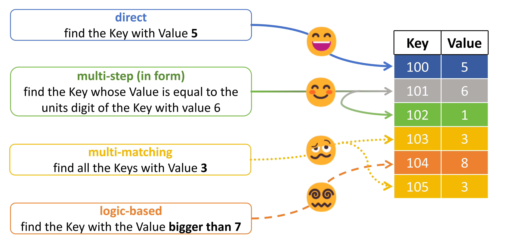

# Difficult retrieval tasks, And their HYPER-MULTI-STEP nature

[📜paper: Hyper-multi-step: The Truth Behind Difficult Long-context Tasks](https://arxiv.org/abs/2410.04422)

[📚Datasets Download](https://huggingface.co/datasets/yuyijiong/difficult_retrieval)

**abstract:** Long-context language models (LCLM), characterized by their extensive context window, is becoming increasingly popular. Meanwhile, many long-context benchmarks present challenging tasks that even the most advanced LCLMs struggle to complete. However, the underlying sources of various challenging long-context tasks have seldom been studied. To bridge this gap, we conduct experiments to indicate their difficulty stems primarily from two basic issues: "multi-matching retrieval," which requires the simultaneous retrieval of multiple items, and "logic-based retrieval," which necessitates logical judgment within retrieval criteria. These two problems, while seemingly straightforward, actually exceed the capabilities of LCLMs because they are proven to be hyper-multi-step (demanding numerous steps to solve) in nature. This finding could explain why LLMs struggle with more advanced long-context tasks, providing a more accurate perspective for rethinking solutions for them.




We find 2 types of retrieval tasks which is much more difficult for long-context language models (LCLMs) than normal retrieval:
1. multi-matching retrieval tasks
2. logic-based retrieval tasks


Our findings can explain why LCLMs, despite having a large context window, still always fail in advanced long-context tasks.

## Evaluate LLMs
* We construct a Key-Value pair Retrieval dataset and a student resumes analysis dataset to evaluate the performance of LLMs on these difficult retrieval tasks.

* You can use ``evaluate.py`` to test the performance of LLMs on these difficult retrieval tasks or other retrieval tasks.

* You should directly modify the code in ``evaluate.py`` to choose different tasks, models, prompt types.

The tasks we provide are:
```
"simple_k2v": Direct key-to-value retrieval. The key is given and the model needs to retrieve the corresponding value.
"simple_v2k": Direct value-to-key retrieval. The value is given and the model needs to retrieve the corresponding key.
"multi_step": multi-step KV retrieval. The model needs to retrieve multiple values with multiple queries.
"logic": logic-based KV retrieval. All the values are in range 0-9. We give the range of the value and the model needs to retrieve the corresponding key.
"multi_match": multi-match KV retrieval. The value is given and the model needs to retrieve multiple corresponding keys.
"multi_match_last": multi-match KV retrieval. The value is given and the model needs to retrieve multiple corresponding keys. The other gold keys are already given in the prompt, except the last one.
```

The prompt style we provide are:
```
None: default prompt, let the model give the answer directly
"cot": add CoT prompt, let hte model 'think step by step'
"one-by-one": add one-by-one prompt, let the model 'examine every item one by one'
```

# Explore their Hyper-multi-step nature
See the results and conclusion in the paper.

## hidden states linear probing
* We use phi-3.5-mini as the model for study.
* You can first use the code in ``hidden_states_probing/get_hidden_states.py`` to get the hidden states and store them.
* And then use the code in ``hidden_states_probing/linear_probing.py`` to do the linear probing.
* You need to directly modify the code to choose different tasks.

## Attention analysis
* We use phi-3.5-mini as the model for study.
* You can first use the code in ``attention_analysis/get_attn.py`` to get the attention weights and store them.
* And then use the code in ``attention_analysis/visualize_attn.py`` to visualize the attention weights.
* You need to directly modify the code to choose different tasks, or whether calculating relative attention weights or not.

## Logic-based retrieval using RAG models
* We use RAG models (sentence embedding models) to do the logic-based retrieval tasks.
* Use the code in ``RAG_model_for_logic/equal.py`` to test the model on logic-based retrieval tasks. The logical relationship in the query is an equality relationship.
* Use the code in ``RAG_model_for_logic/range.py`` to test the model on logic-based retrieval tasks. The logical relationship in the query is a less-than-and-greater-than relationship.

